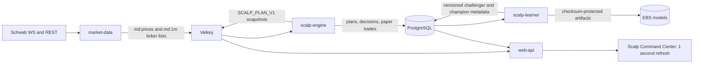

# Release 5: Scalp-Only Production Cutover

Release 5 removes the legacy scanner, mixed learner, old dashboard, duplicate
Compose manifest, and systemd deployment fallback. Historical PostgreSQL data,
Schwab token files, logs, and promoted model artifacts are preserved.

## Runtime ownership

- `token-service` is the sole Schwab refresh-token owner.
- `market-data` is the sole quote and one-minute bar publisher.
- `scalp-engine` is the sole signal-plan and paper-entry owner.
- `scalp-learner` owns canonical outcome observation and advisory ML training.
- `scheduler`, `context-intel`, and `watchdog` remain isolated infrastructure.

## Signal cycle

1. Read all ticker quotes from the `md:prices` hash in one operation.
2. Read all `md:1m:{ticker}` lists in one Valkey pipeline.
3. Calculate RSI-14/7/2, MACD 12/26/9 histogram, ATR-14, session VWAP,
   20-bar RVOL, and local swing structure from closed one-minute bars.
4. Build both LONG and SHORT candidates with deterministic ATR/spread risk and
   UI-configured TP1/TP2 R multiples.
5. Select the strongest valid or nearest-valid candidate and retain every
   blocker. Every ticker receives a plan, including explicit data gaps.
6. Apply the advisory ML overlay only to an already valid deterministic plan.
7. Apply expiring context-learning controls. Learning may tighten confidence,
   reduce size, or block; it cannot create a setup or change bracket geometry.
8. Submit an executable plan to the paper broker at most once per ticker/bar.

## Deployment gate

The GitHub deployment performs these mandatory steps:

1. Build the image and run Compose with `--remove-orphans`.
2. Fail if `nasdaq-scanner` or `nasdaq-learner` still exists.
3. Require healthy token-service, web-api, market-data, scalp-engine, and
   scalp-learner containers.
4. Run `scripts/activate_scalp_only.py` inside scalp-engine.
5. Activate paper execution only when the canonical snapshot is fresh, covers
   at least 400 tickers, and both new service heartbeats are fresh.

The activation writes `scalp.execution_enabled=true` and
`scalp.shadow_enabled=false` through the PostgreSQL configuration store and
Valkey hot-reload channel. Operators can immediately halt new entries from the
Settings page by disabling `scalp.execution_enabled`; open-position management
and health monitoring continue.

## Preserved data

- PostgreSQL trade, outcome, audit, context, configuration, and OHLCV tables
- `/opt/nasdaq-agent/tokens`
- `/opt/nasdaq-agent/models`
- `/opt/nasdaq-agent/logs`
- `/opt/nasdaq-agent/cache`

No deployment step deletes these paths or truncates their tables.
