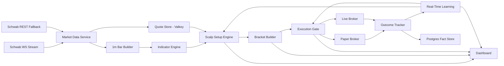

# Scalping Platform Redesign

## Intent

This design defines a new scalping-only platform from first principles. It is not a continuation of the current mixed prediction, swing, backtest, and paper-trading flow.

The new platform has one primary question:

> Is there a valid scalp entry right now with fresh market data, real-time technical confirmation, deterministic risk-based targets, acceptable execution quality, and positive learned expectancy for this exact setup?

Anything that does not answer that question directly is context only.

## Delivery Status

### Release 1: deterministic domain core

- Pure indicator, quote, setup, and bracket contracts live under `agent/scalp/`.
- `ScalpSignalPlan` is versioned and contains complete input, geometry, reason,
  blocker, source, and freshness facts.
- The module can be tested without importing the legacy scanner or broker.

### Release 2: shadow integration and controlled paper cutover

- The scanner builds an independent scalp plan without consulting the legacy
  prediction direction.
- Every scanner row exposes its complete plan as `scalp_plan` for shadow review.
- PostgreSQL stores executed/attempted plans and execution decisions, and paper
  trades link back through `scalp_plan_id` and `SCALP_PLAN_V1`.
- When `scalp.execution_enabled=true`, legacy entry calls cannot open a paper
  trade; a valid persisted `ScalpSignalPlan` is mandatory.
- The default remains `scalp.execution_enabled=false`. Deploying Release 2 does
  not change the production execution owner until an administrator performs the
  explicit settings-page cutover.
- `/settings` is the catalog-driven configuration surface. It includes every
  runtime key, hides advanced controls by default, validates scalp relationships
  server-side, and replaces the dashboard settings modal.

## Non-Negotiable Principles

1. Every displayed trade idea must have a complete trade plan: entry, stop, TP1, TP2, risk per share, reward multiple, and invalidation reason.
2. TP1, TP2, and stop loss are built from configured risk/reward math, not arbitrary support/resistance targets.
3. RSI, MACD, ATR, VWAP, spread, and freshness are required real-time inputs. Missing data makes the plan invalid.
4. ML does not create bracket geometry. ML can raise/lower confidence, throttle setups, or block statistically bad contexts.
5. A signal is not a trade until it passes the execution gate.
6. The dashboard must explain both why a trade is valid and why a trade is blocked.
7. Paper trading must simulate live trading as closely as possible: spread, slippage, partial exits, bracket orders, stale data, liquidity, and risk brakes.
8. Learning must update from every outcome, but production gating must be bounded and auditable.

## Canonical Object

The new source of truth is `ScalpSignalPlan`.

```python
@dataclass
class ScalpSignalPlan:
    ticker: str
    side: Literal["LONG", "SHORT", "NONE"]
    valid: bool
    invalid_reason: str

    entry: float
    stop_loss: float
    tp1: float
    tp2: float
    risk_per_share: float
    reward_r: float
    rr_ratio: float

    price: float
    bid: float
    ask: float
    spread_bps: float
    spread_to_risk: float
    data_age_ms: int
    bar_age_ms: int
    source: Literal["WS", "REST", "STALE", "UNKNOWN"]

    rsi_14: float
    rsi_7: float
    rsi_2: float
    rsi_zone: str
    macd_hist: float
    macd_hist_prev: float
    macd_slope: float
    atr_14: float
    vwap: float
    vwap_event: str
    rvol: float

    setup_type: str
    setup_score: float
    confidence: float
    learned_expectancy_r: float
    learned_win_rate: float
    reasons: list[str]
    blockers: list[str]
```

No execution path should open a paper or live trade without this object.

## System Architecture



## Service Boundaries

### market-data

Owns Schwab WS and REST fallback.

Responsibilities:

- Maintain live quote state per ticker.
- Publish source counts: WS, REST, stale.
- Emit quote freshness and source per ticker.
- Build or feed 1-minute bars.
- Never mark system live if quotes are stale or fallback-only without telling downstream services.

Outputs:

- `quote:{ticker}`
- `quote_source:{ticker}`
- `bar_1m:{ticker}`
- `market_data_health`

### indicator-engine

Owns real-time indicator calculation.

Responsibilities:

- Build indicators from closed 1-minute bars.
- Optionally build a provisional current-bar snapshot from live quote.
- Calculate RSI-14, RSI-7, RSI-2, MACD 12/26/9, fast MACD 8/17/9, ATR-14, VWAP, RVOL.
- Reject stale or insufficient bars.

Outputs:

- `indicator_snapshot:{ticker}`
- `indicator_health`

Required bar depth:

- RSI-14: at least 20 bars.
- MACD 12/26/9: at least 35 bars.
- ATR-14: at least 20 bars.
- VWAP: current session bars.

If any required indicator cannot be computed, `ScalpSignalPlan.valid = false`.

### scalp-engine

Owns trade idea generation.

Responsibilities:

- Detect setup candidates.
- Create `ScalpSignalPlan`.
- Keep signal logic deterministic and explainable.
- Use ML only as context and confidence overlay.

Core setup families:

- VWAP reclaim long.
- VWAP rejection short.
- Oversold MACD turn long.
- Overbought MACD turn short.
- Opening range breakout long/short.
- Pullback-to-VWAP continuation.
- Exhaustion reversal only when strict confirmation exists.

### bracket-builder

Owns stop and target math.

Inputs:

- Entry price.
- Side.
- ATR.
- Spread.
- Configured reward multiple.
- Min/max stop constraints.

Rules:

```text
risk = max(
  atr_14 * stop_atr_multiple,
  entry * min_stop_pct,
  spread * spread_buffer_mult,
  tick_size_floor
)

risk = min(risk, entry * max_stop_pct)
```

LONG:

```text
stop = entry - risk
tp1  = entry + 1.0 * risk
tp2  = entry + reward_r * risk
```

SHORT:

```text
stop = entry + risk
tp1  = entry - 1.0 * risk
tp2  = entry - reward_r * risk
```

Support/resistance does not set TP2. It only contributes a path-quality field:

```text
tp2_path = CLEAR | BLOCKED_BY_RESISTANCE | BLOCKED_BY_SUPPORT | UNKNOWN
```

### execution-gate

Owns final permission to trade.

Required checks:

- Market data source is live or explicitly allowed fallback.
- Quote age is below max threshold.
- Spread-to-risk is below configured maximum.
- RSI/MACD/ATR/VWAP are present.
- Setup family is enabled.
- Session is tradable.
- Ticker is not in cooldown.
- Family/context expectancy is not negative beyond threshold.
- Portfolio and daily loss controls pass.
- TP2 path is not blocked unless configured override allows reduced size.

### broker

Paper and live broker must share the same order intent model.

Order intent:

```python
BracketOrderIntent:
    ticker
    side
    quantity
    entry_type
    entry_price
    stop_loss
    tp1
    tp2
    partial_exit_pct
    time_stop_bars
    signal_plan_id
```

Paper broker simulates:

- Bid/ask spread.
- Slippage.
- Partial exit at TP1.
- Stop move after TP1.
- Trail after TP1 if configured.
- Time stop.
- Stale quote no-fill.
- Liquidity penalty.

## Signal Logic

### LONG candidate

Required setup conditions:

```text
rsi_zone in OS, EXTREME_OS
macd_hist rising OR macd_hist crosses above previous
price reclaims VWAP OR bounces from support OR closes above trigger level
atr_14 > 0
spread_to_risk <= max_spread_to_risk
rvol >= configured minimum for session
```

Blockers:

```text
RSI neutral or overbought
MACD falling
price below VWAP with no reclaim
ATR missing
spread too wide
quote stale
TP2 path blocked by resistance
learned expectancy negative
```

### SHORT candidate

Required setup conditions:

```text
rsi_zone in OB, EXTREME_OB
macd_hist falling OR macd_hist crosses below previous
price rejects VWAP OR rejects resistance OR closes below trigger level
atr_14 > 0
spread_to_risk <= max_spread_to_risk
rvol >= configured minimum for session
```

Blockers:

```text
RSI neutral or oversold
MACD rising
price above VWAP with no rejection
ATR missing
spread too wide
quote stale
TP2 path blocked by support
learned expectancy negative
```

## Real-Time Learning

Learning is split into bounded layers.

### Immediate outcome learning

Runs whenever a trade closes.

Writes:

- setup type.
- side.
- ticker.
- session.
- RSI zone.
- MACD state.
- VWAP event.
- spread bucket.
- ATR bucket.
- TP1 hit.
- TP2 hit.
- stop hit.
- time stop.
- pnl_r.
- pnl_dollar.
- mfe_r.
- mae_r.

Updates rolling stats:

- 30 minute.
- 2 hour.
- current session.
- trailing 5 sessions.

Allowed immediate actions:

- Raise confidence floor.
- Reduce size.
- Pause a setup family.
- Pause ticker.
- Block a context bucket.

Not allowed:

- Unbounded parameter drift.
- Model promotion without validation.
- Lowering risk brakes automatically.

### Online adaptive gate

Purpose:

Answer whether a setup context should be traded right now.

Recommended first implementation:

- Bayesian beta-binomial win-rate estimate.
- EWMA expectancy estimate.
- Minimum samples before hard block.
- Session reset with carryover memory.

Context key:

```text
setup_family | side | session | rsi_zone | macd_state | vwap_event | spread_bucket
```

Gate states:

```text
ALLOW
SIZE_REDUCE
CONFIDENCE_RAISE
BLOCK
WATCH_ONLY
```

### Batch ML

Batch models are advisory overlays.

They can produce:

- probability of TP1 before stop.
- probability of TP2 before stop.
- expected R.
- setup confidence adjustment.

They cannot:

- create a trade without a valid setup.
- set stop or target geometry.
- bypass execution gates.

Promotion requirements:

- Chronological holdout.
- No scaler leakage.
- Out-of-sample expectancy > 0.
- Profit factor > 1.0.
- Minimum sample count.
- Stable performance across at least two recent sessions.

## Storage Model

### `scalp_signal_plans`

Stores one row per generated plan.

Important columns:

- id.
- ticker.
- plan_ts.
- side.
- valid.
- invalid_reason.
- entry.
- stop_loss.
- tp1.
- tp2.
- risk_per_share.
- reward_r.
- rr_ratio.
- setup_type.
- confidence.
- data_source.
- data_age_ms.

### `scalp_indicator_snapshots`

Stores the exact indicators used for a decision.

Important columns:

- plan_id.
- ticker.
- snapshot_ts.
- rsi_14.
- rsi_7.
- rsi_2.
- rsi_zone.
- macd_hist.
- macd_hist_prev.
- macd_slope.
- atr_14.
- vwap.
- vwap_event.
- rvol.

### `scalp_execution_decisions`

Stores final gate decision.

Important columns:

- plan_id.
- decision.
- blockers.
- size_mult.
- confidence_floor.
- source_service.

### `scalp_trade_outcomes`

Stores lifecycle outcome.

Important columns:

- plan_id.
- trade_id.
- side.
- entry_fill.
- exit_fill.
- tp1_hit.
- tp2_hit.
- stop_hit.
- pnl_r.
- pnl_dollar.
- mfe_r.
- mae_r.
- exit_reason.

### `scalp_learning_actions`

Stores every automatic learning action.

Important columns:

- action_ts.
- context_key.
- action_type.
- old_value.
- new_value.
- reason.
- expires_at.

## Dashboard Requirements

The dashboard must show four distinct concepts.

### Market data health

- WS count.
- REST count.
- stale count.
- quote age.
- last bar age.

### Signal plan dashboard

Columns:

- ticker.
- side.
- valid/blocked.
- setup type.
- entry.
- stop.
- TP1.
- TP2.
- R:R.
- RSI.
- MACD.
- ATR.
- VWAP.
- spread/risk.
- confidence.
- learned expectancy.
- reason.

### Why no trade

Every ticker should have one of:

- valid LONG.
- valid SHORT.
- watch only.
- blocked with reason.
- data gap.

### Learning dashboard

Shows:

- setup family performance.
- current blocked contexts.
- confidence raises.
- size reductions.
- rolling expectancy.
- recent automatic decisions.

## Configuration

All parameters must be runtime-configurable.

Core settings:

```text
scalp.reward_r = 2.0
scalp.tp1_r = 1.0
scalp.stop_atr_multiple = 1.0
scalp.min_stop_pct = 0.003
scalp.max_stop_pct = 0.020
scalp.max_spread_to_risk = 0.25
scalp.max_quote_age_ms = 2000
scalp.max_bar_age_ms = 120000
scalp.min_rvol_regular = 0.8
scalp.min_rvol_extended = 0.4
scalp.require_vwap_event = true
scalp.require_macd_confirm = true
scalp.require_rsi_zone = true
scalp.allow_rest_fallback_trading = false
```

Learning settings:

```text
learn.min_samples_to_block = 5
learn.rolling_window_min = 120
learn.negative_expectancy_block_r = -0.20
learn.confidence_raise_step = 10
learn.size_reduce_mult = 0.50
learn.context_block_ttl_min = 60
```

## Release Plan

### Release 1: Greenfield scalp plan core

Deliverables:

- Add the modular `agent/scalp/` package for contracts, indicator extraction,
  bracket math, and setup evaluation.
- Keep `agent/scalp_signal.py` as the stable public import facade.
- Add `ScalpSignalPlan` dataclass.
- Add deterministic bracket builder.
- Add real-time indicator validation.
- Add unit tests for LONG, SHORT, missing RSI/MACD, stale quote, and 1:2 bracket math.
- Dashboard can read and display plan fields, but execution still uses existing path.

No live/paper execution behavior changes in this release.

The UI and deployment companions for this release are documented in
`scalp_command_center.md` and `legacy_retirement_plan.md`. The new command
center is developed behind a feature flag and the legacy runtime is removed
only after data parity and single-owner checks pass.

### Release 2: Execution cutover

Deliverables:

- Paper trading opens only from valid `ScalpSignalPlan`.
- Persist plan id with every paper trade.
- Enforce bracket intent in paper broker.
- Preserve legacy signal generation for watch-only display.

### Release 3: Learning cutover

Deliverables:

- Immediate outcome updates from every trade close.
- Context expectancy gate.
- Learning action audit trail.
- Dashboard for active learning actions.

### Release 4: ML overlay redesign

Deliverables:

- Train TP1-before-stop and TP2-before-stop models.
- Promote models only with economic validation.
- ML adjusts confidence only.

### Release 5: Legacy retirement

Deliverables:

- Remove execution dependency on mixed composite prediction.
- Keep old ML/swing/daily analytics as non-execution context if useful.
- Remove duplicated risk/reward settings.

## Migration Rules

1. New files live beside old code until Release 5.
2. Existing production execution remains unchanged until Release 2.
3. Every release must have tests proving no regression in dashboard load and paper broker safety.
4. No hidden fallback from missing indicators to neutral values.
5. Any auto-learning action must be reversible and time-bounded.

## Success Criteria

The redesign is successful when:

- Every trade has a `ScalpSignalPlan`.
- Every TP1/TP2/SL is exactly explainable from configured risk math.
- Missing RSI/MACD/ATR/VWAP prevents execution.
- Dashboard shows why each ticker is tradable or blocked.
- Paper trading outcomes match realistic fills and bracket behavior.
- Learning can pause or throttle bad contexts within the same session.
- ML improves filtering without becoming an untraceable trade trigger.
